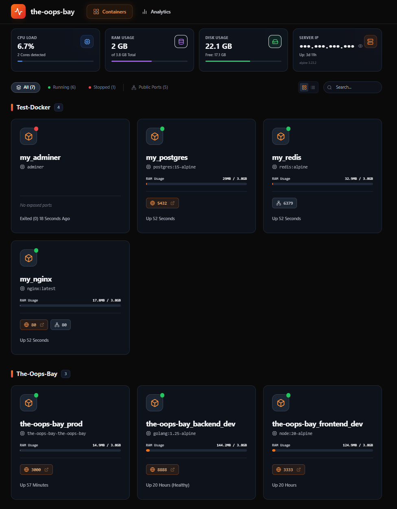
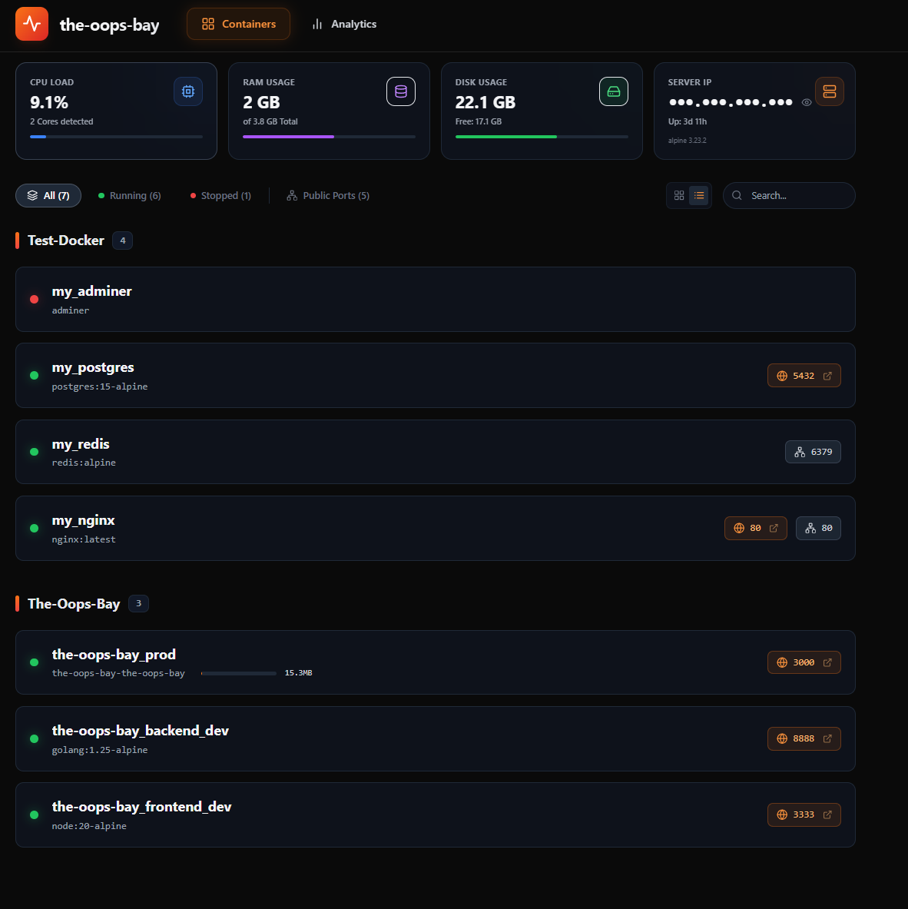
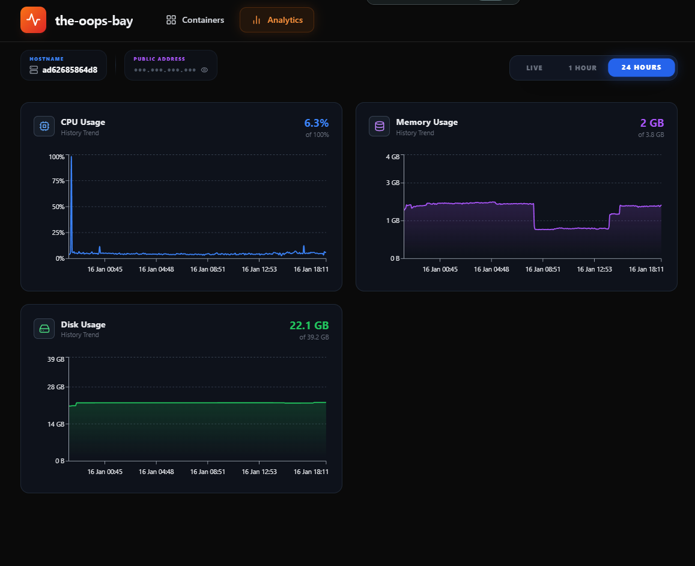

# 🐳 The Oops Bay

   

**The Oops Bay** is a fast, elegant, and **extremely simple** dashboard for managing Docker containers 🧘‍♂️

No clutter. No cognitive overload. No enterprise bloat.  
**Oops Bay** is built for people who want to *understand what’s going on at a glance* — not fight with the UI.

---


---

---


## 🚀 Quick Start (Up and Running in 1 Minute)

We respect your time ⏱️ — setup is right here at the top.

### Option 1: Docker CLI

```bash
docker run -d \
  --name the-oops-bay \
  --restart unless-stopped \
  -p 3000:3000 \
  -v /var/run/docker.sock:/var/run/docker.sock \
  -v ./oops-data:/app/data \
  medzhidovomar/the-oops-bay
````
For localhost-only, on VPS replace with: 127.0.0.1:3000:3000

Open your browser at:
👉 **[http://localhost:3000](http://localhost:3000)** or your server IP on LAN.

---

### Option 2: Docker Compose

Create `docker-compose.yml`:

```yaml
services:
  the-oops-bay:
    image: medzhidovomar/the-oops-bay:latest
    container_name: the-oops-bay
    restart: unless-stopped
    ports:
      - "3000:3000"       # Default: open to all interfaces
      # - "127.0.0.1:3000:3000"  # Optional: bind to localhost only for security
    volumes:
      - /var/run/docker.sock:/var/run/docker.sock # Docker API access
      - ./oops-data:/app/data                   # Persistent storage

```

Run it:

```bash
docker-compose up -d
```

> **Note:** Access to `/var/run/docker.sock` is required to manage containers and collect stats.

---

## ⚠️ Security & Networking Considerations

Exposing **The Oops Bay** dashboard to the internet without authentication is **dangerous**.
Here’s how to do it safely.

### 🔒 Localhost-only binding (Recommended)

```yaml
ports:
  - "127.0.0.1:3000:3000"
```

This ensures the dashboard is **not visible externally**.

### 🌐 VPS / Remote Servers

* **SSH Tunneling (Recommended)**

```bash
ssh -L 3000:localhost:3000 user@your-vps-ip
```

Then open: [http://localhost:3000](http://localhost:3000)

* **VS Code Remote – SSH**
  Ports may be automatically forwarded.

### 🏠 HomeLab / LAN Access

* Use default `3000:3000` binding
* Access via server local IP: `http://192.168.1.50:3000`
* Ensure firewall allows traffic on port `3000`

### 🧱 Using a Reverse Proxy (Caddy / Nginx / Traefik)

Even without auth, a reverse proxy can:

* Terminate HTTPS (TLS)
* Restrict access by IP or VPN
* Add optional basic auth
* Hide dashboard from direct internet exposure

Example **Caddyfile**:

```caddy
theoopsbay.example.com {
    reverse_proxy localhost:3000

    # Optional: basic auth
    # basicauth {
    #     admin JDJhJDE0JHNhbXBsZXBhc3N3b3Jk
    # }
}
```

> ⚠️ Reverse proxy helps **isolate, encrypt, and control access**,
> but it **does NOT make an unauthenticated dashboard completely secure**.

---

## ✨ Why The Oops Bay?

> **Simplicity first. Clarity over features. UX over checklists.** 🎯

* **🧠 Radically Simple UI**
  Low cognitive load, clean layout, everything visible at a glance.

* **⚡ Incredible Performance**
  Go + Fiber backend, minimal CPU & RAM usage.

* **📊 Historical Metrics**
  CPU & RAM usage history, beautiful charts, no paid tiers.

* **🎨 Modern UX/UI**
  React + Vite + Tailwind + Framer Motion, fully responsive.

* **🛠 Effortless Customization**
  Rename containers, custom icons, group by project.

---

## 🆚 Comparison

| Feature              | The Oops Bay 🌊 | Portainer           | Dozzle        | Standard CLI |
| -------------------- | --------------- | ------------------- | ------------- | ------------ |
| UI Simplicity        | ⭐⭐⭐⭐⭐ (Minimal) | ⭐⭐ (Bloated)        | ⭐⭐⭐           | ❌            |
| Cognitive Load       | Very Low 🧘‍♂️  | High 🧠💥           | Medium        | High         |
| Resource Usage       | ⭐⭐⭐⭐⭐ (Low)     | ⭐⭐ (High)           | ⭐⭐⭐⭐ (Low)    | N/A          |
| Historical Charts    | ✅               | ❌ (Business only)   | ❌             | ❌            |
| Control (Start/Stop) | ✅               | ✅                   | ❌ (Logs only) | ✅            |
| UI / Aesthetics      | Modern (2025+)  | Enterprise (Legacy) | Simple        | Console      |
| Speed                | Go + Fiber 🚀   | Go (Slow API)       | Go            | Instant      |

---

## 🛠 Tech Stack

**Backend:** Go 1.21+, Fiber, GORM (SQLite), Docker SDK
**Frontend:** React 18, Vite, TailwindCSS, Lucide Icons
**Charts:** Recharts

---

## 🤝 Contribution

Pull Requests welcome ❤️

### Prerequisites

* Go 1.21+
* Node.js 18+
* Docker (running locally)

### Run Locally

```bash
git clone https://github.com/justomar/the-oops-bay.git
cd the-oops-bay
```

Frontend:

```bash
cd frontend
npm install
npm run dev
```

Backend:

```bash
go mod download
go run .
```

API available at `http://localhost:3000/api`.

---

## 📝 License

**GNU AGPL v3.0** 📜

You can use, modify, and distribute —
**but if you run it as a service, you must share your changes.**

---

<p align="center">
Made with ❤️ and a strong dislike for bloated UIs<br/>
for the Docker Community 🐳
</p>

